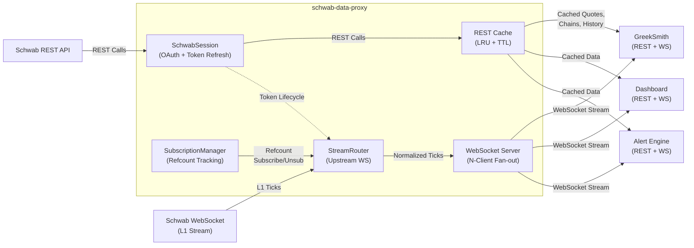
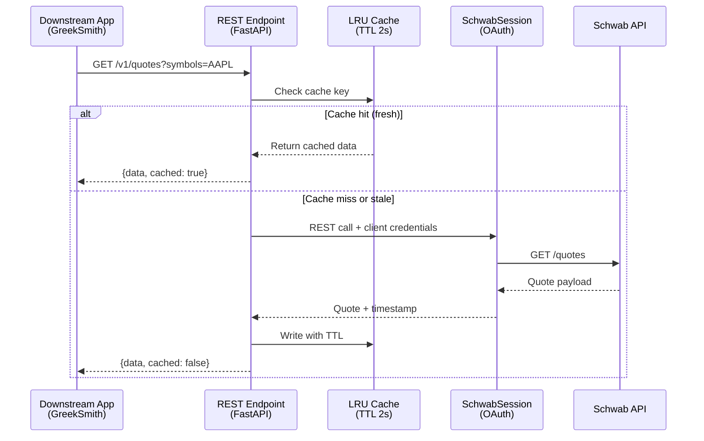
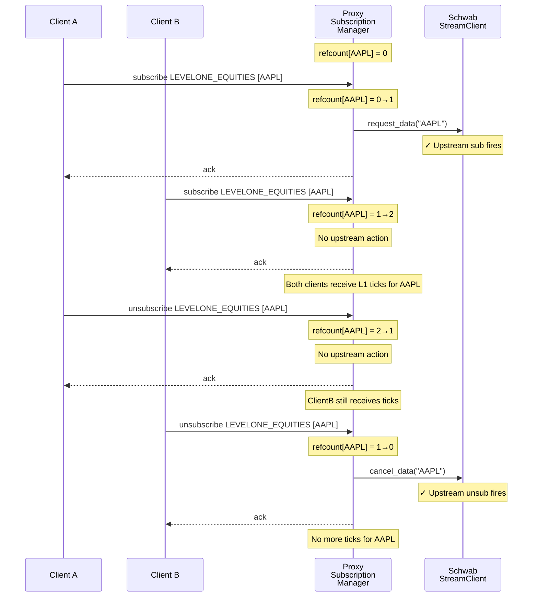
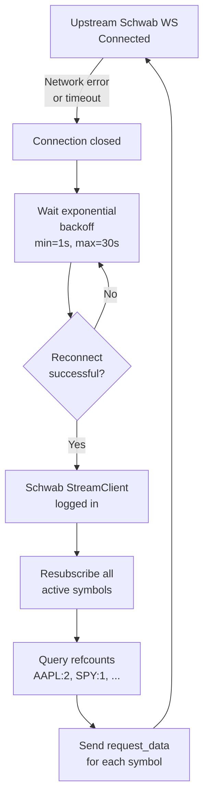
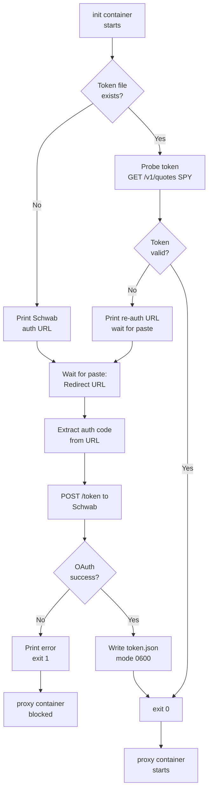
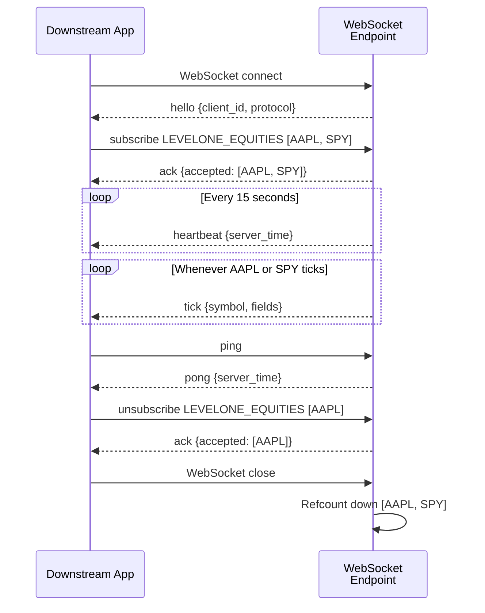
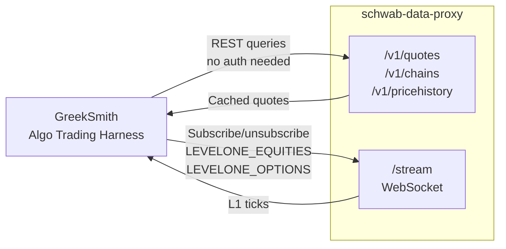

# schwab-data-proxy

**A standalone Docker service that multiplexes Schwab market data to N downstream consumers over both REST and WebSocket.**

## Why this exists

Schwab's OAuth implementation allows only **one registered application per trader account**. This creates a hard constraint: if you want to run GreekSmith (a trading harness) alongside other market-aware tools (dashboards, alert engines, risk monitors), each cannot maintain independent Schwab credentials.

`schwab-data-proxy` solves this by becoming the *single source of truth* for your Schwab connection. The proxy holds the OAuth credential and token lifecycle. All downstream consumers (GreekSmith, dashboards, etc.) connect to the proxy over REST and WebSocket—no Schwab credentials needed in any individual app.

The proxy's core capabilities:

- **Reference-counted subscriptions**: Upstream symbol subscriptions fire only when the first client requests it (0→1), and drop only when the last client releases it (1→0)
- **TTL + LRU caching**: REST responses are cached to avoid rate-limit exhaustion
- **Token lifecycle management**: Background refresh loop keeps the OAuth session alive
- **N-way fan-out**: One upstream Schwab WebSocket streams L1 ticks to unlimited downstream clients
- **Queue overflow handling**: Per-client queues are bounded; oldest ticks drop to ensure the latest data always flows

## Architecture



## How it works

### REST flow

REST requests (quotes, chains, price history, market hours) follow a cache-first path:



**Key points:**
- Every REST response includes a `cached` flag and `as_of` timestamp
- Default TTL is 2 seconds; configurable via `CACHE_TTL_SECONDS`
- Cache key includes all query parameters to avoid false hits
- If Schwab is unavailable, cached data is returned even if expired (best-effort)

### Streaming / subscription lifecycle

WebSocket subscriptions are reference-counted. Upstream subscriptions fire only on the **0→1 transition** (first client requests), and drop on the **1→0 transition** (last client releases).



**Reference counting rules:**
- Per service (LEVELONE_EQUITIES vs LEVELONE_OPTIONS) and per symbol
- Multiple subscriptions to the same symbol from the same client are deduplicated
- Unsubscribe must exactly match the original subscribe (service + symbol set)
- On client disconnect, all subscriptions auto-refcount down

### Reconnect behavior

The proxy maintains a WebSocket connection to Schwab. If the connection drops, it reconnects with exponential backoff and **resubscribes to all active symbols** so downstream clients never lose service:



**Reconnect guarantees:**
- Per-client queues are **not** cleared on reconnect; clients receive ticks uninterrupted
- Refcounts are preserved across upstream reconnects
- If reconnect fails after max retries, `/readyz` returns 503 and GreekSmith containers fail their health checks

## Bootstrap & startup

The Docker Compose setup includes an `init` service that runs before the proxy starts. It performs OAuth bootstrap and token validation:



**Important:**
- Run `docker compose up` **attached** (without `-d`) on first run — the bootstrap prompt appears in the terminal
- After token is bootstrapped once, subsequent starts are automatic — the init service probes the token and exits immediately
- Token file is stored in a Docker volume and persists across restarts

## Quickstart

```bash
cp .env.template .env
# Fill in SCHWAB_DATA_APP_KEY, SCHWAB_DATA_APP_SECRET, SCHWAB_DATA_CALLBACK_URL
docker compose up
```

> **WARNING: Run `docker compose up` ATTACHED (without `-d`) on first run.**
> The bootstrap prompt appears in the terminal — if you run `-d`, the prompt is
> buried in logs and the stack will hang waiting for input. After bootstrap
> succeeds once, `-d` is safe for subsequent starts (init exits immediately if
> the token is valid).

### First run (token does not exist or has expired)

1. The `init` container prints a Schwab auth URL.
2. Open it in a browser, log in, and authorize the app.
3. Your browser will redirect to your callback URL — the page may fail to load. That is expected.
4. Copy the **full redirect URL** from the address bar and paste it into the terminal.
5. The token is written to the `schwab-token` Docker volume; the `proxy` service starts automatically.

### Subsequent runs

```bash
docker compose up -d
```

The `init` container probes the existing token, finds it valid, and exits 0 immediately. The `proxy` starts without any user interaction.

### Token gate bootstrap (manual re-auth only)

If the proxy starts with a 401 error (expired refresh token), re-run bootstrap:

```bash
docker compose run --rm init
```

### Docker run (single container, no compose)

```bash
docker build -t schwab-data-proxy .
docker run -d \
  --name schwab-data-proxy \
  -p 127.0.0.1:8080:8080 \
  --env-file .env \
  -v "$(pwd)/token.json:/data/token.json:rw" \
  schwab-data-proxy
```

Note: `docker run` does not execute the bootstrap gate. Produce a valid `token.json` on the host first using `docker compose run --rm init`, then mount it.

Check health:

```bash
curl http://localhost:8080/healthz
curl http://localhost:8080/readyz
```

`/readyz` returns `503` until the streaming session has logged in (typically within 2-3 seconds of startup).

## Configuration

| Variable | Default | Description |
|----------|---------|-------------|
| `SCHWAB_DATA_APP_KEY` | required | Schwab market data app key |
| `SCHWAB_DATA_APP_SECRET` | required | Schwab market data app secret |
| `SCHWAB_DATA_CALLBACK_URL` | required | OAuth callback URL registered with Schwab |
| `SCHWAB_DATA_TOKEN_PATH` | `/data/token.json` | Path to pre-bootstrapped token file inside container |
| `PORT` | `8080` | HTTP/WebSocket listen port |
| `CACHE_TTL_SECONDS` | `2` | TTL for REST response cache |
| `LOG_LEVEL` | `INFO` | Python logging level: `DEBUG`, `INFO`, `WARNING`, `ERROR` |

## REST API Reference

All responses use the envelope:

```json
{"data": <schwab payload>, "cached": true|false, "as_of": "2026-06-15T14:30:00.123456+00:00"}
```

Error envelope:

```json
{"error": {"code": "UPSTREAM_ERROR", "message": "...", "upstream_status": 502}}
```

### GET /v1/quotes

Fetch real-time quotes for one or more symbols.

| Parameter | Type | Required | Description |
|-----------|------|----------|-------------|
| `symbols` | string | yes | Comma-separated ticker list: `AAPL,MSFT` |
| `fields` | string | no | Comma-separated subset: `quote,reference,extended,fundamental,regular` |

```bash
curl "http://localhost:8080/v1/quotes?symbols=AAPL,SPY&fields=quote"
```

### GET /v1/chains

Fetch option chain for a single underlying.

| Parameter | Type | Required | Description |
|-----------|------|----------|-------------|
| `symbol` | string | yes | Underlying ticker |
| `contract_type` | string | no | `CALL`, `PUT`, `ALL` |
| `strike_count` | int | no | Number of strikes above/below ATM |
| `include_underlying_quote` | bool | no | Include underlying quote in response |
| `strategy` | string | no | `SINGLE`, `ANALYTICAL`, `COVERED`, `VERTICAL`, `CALENDAR`, `STRANGLE`, `STRADDLE`, `BUTTERFLY`, `CONDOR`, `DIAGONAL`, `COLLAR`, `ROLL` |
| `interval` | float | no | Strike interval |
| `strike` | float | no | Specific strike price |
| `range` | string | no | `ITM`, `NTM`, `OTM`, `SAK`, `SBK`, `SNK`, `ALL` |
| `from_date` | string | no | ISO date `YYYY-MM-DD` |
| `to_date` | string | no | ISO date `YYYY-MM-DD` |
| `volatility` | float | no | Volatility override for analytical pricing |
| `underlying_price` | float | no | Underlying price override |
| `interest_rate` | float | no | Interest rate override |
| `days_to_expiration` | int | no | Days to expiration override |
| `exp_month` | string | no | Expiration month: `JAN`..`DEC`, `ALL` |
| `option_type` | string | no | `S` (standard), `NS` (non-standard), `ALL` |
| `entitlement` | string | no | `PP`, `NP`, `PN` |

```bash
curl "http://localhost:8080/v1/chains?symbol=SPY&contract_type=CALL&range=NTM&from_date=2026-06-20&to_date=2026-07-18"
```

### GET /v1/pricehistory

Fetch OHLCV candles.

| Parameter | Type | Required | Description |
|-----------|------|----------|-------------|
| `symbol` | string | yes | Ticker |
| `period_type` | string | no | `day`, `month`, `year`, `ytd` |
| `period` | int | no | Number of periods |
| `frequency_type` | string | no | `minute`, `daily`, `weekly`, `monthly` |
| `frequency` | int | no | Frequency within type |
| `start_datetime` | string | no | ISO8601 start |
| `end_datetime` | string | no | ISO8601 end |
| `need_extended_hours_data` | bool | no | Include pre/post market |
| `need_previous_close` | bool | no | Include previous close |

```bash
curl "http://localhost:8080/v1/pricehistory?symbol=AAPL&period_type=day&period=5&frequency_type=minute&frequency=1"
```

### GET /v1/markets

Fetch market hours.

| Parameter | Type | Required | Description |
|----------|---|---|---|
| `markets` | string | yes | Comma-separated: `equity,option,bond,future,forex` |
| `date` | string | no | ISO date `YYYY-MM-DD` (defaults to today) |

```bash
curl "http://localhost:8080/v1/markets?markets=equity,option&date=2026-06-15"
```

### GET /healthz

Returns `200 {"status": "ok"}` always (liveness probe).

### GET /readyz

Returns `200 {"status": "ready"}` when session started AND streaming logged in.
Returns `503 {"status": "degraded", "reason": "..."}` otherwise.

## WebSocket Protocol

Connect to `ws://localhost:8080/stream`.

### Client session lifecycle



### Hello frame (server → client, on connect)

```json
{"type": "hello", "client_id": "uuid4", "server_time": "ISO8601", "protocol": 1}
```

### Subscribe

```json
{"type": "subscribe", "service": "LEVELONE_EQUITIES", "symbols": ["AAPL", "SPY"], "ref": "sub-1"}
```

Valid services: `LEVELONE_EQUITIES`, `LEVELONE_OPTIONS`

Ack response:

```json
{"type": "ack", "ref": "sub-1", "service": "LEVELONE_EQUITIES", "accepted": ["AAPL", "SPY"], "rejected": []}
```

### Unsubscribe

```json
{"type": "unsubscribe", "service": "LEVELONE_EQUITIES", "symbols": ["AAPL"], "ref": "unsub-1"}
```

Same ack shape as subscribe.

### Ping / Pong

```json
{"type": "ping"}
```

```json
{"type": "pong", "server_time": "ISO8601"}
```

### Heartbeat (server → client, every 15s)

```json
{"type": "heartbeat", "server_time": "ISO8601"}
```

### Tick frame (server → client)

```json
{
  "type": "tick",
  "service": "LEVELONE_EQUITIES",
  "symbol": "AAPL",
  "ts": "2026-06-15T14:30:01.234567+00:00",
  "fields": {
    "bid": 198.41,
    "ask": 198.43,
    "last": 198.42,
    "volume": 1234567,
    "netChange": -0.58
  }
}
```

### Error frame

```json
{"type": "error", "code": "BAD_COMMAND", "message": "Unknown service: 'FOO'"}
```

### Reconnect / Resubscribe requirement

The server does **not** persist client subscription state across WebSocket reconnects. On disconnect:

1. Reconnect to `/stream`
2. Wait for the `hello` frame
3. Re-send all `subscribe` commands

The server will re-establish upstream Schwab subscriptions as clients reconnect.

## Partial-tick semantics

Schwab streaming sends **delta ticks** — only fields that changed since the last update. Consumers must maintain a local `last_known` state per symbol and merge each incoming tick into it:

```python
last_known = {}

def on_tick(msg):
    sym = msg["symbol"]
    last_known.setdefault(sym, {}).update(msg["fields"])
    process(last_known[sym])
```

Do not treat any single tick as a complete quote snapshot.

## Option symbol format

Schwab streaming uses OSI format for option symbols:

```
{underlying}{expiration}{side}{strike}
```

Example: `AAPL  260117C00200000`

- Underlying padded to 6 chars: `AAPL  `
- Expiration YYMMDD: `260117`
- Side: `C` (call) or `P` (put)
- Strike × 1000, zero-padded to 8 digits: `00200000` = $200.00

## GreekSmith integration

GreekSmith connects to the proxy for both REST data and live streaming:



GreekSmith consumers should:

1. Point REST calls at `http://localhost:8080/v1/...` — no Schwab credentials needed in GreekSmith
2. Connect the streaming client to `ws://localhost:8080/stream`
3. Subscribe to `LEVELONE_EQUITIES` for equity scanners and `LEVELONE_OPTIONS` for Greeks feeds
4. Maintain per-symbol `last_known` state dicts and merge delta ticks
5. Handle `503` from `/readyz` at startup — retry with backoff before assuming the proxy is healthy
6. On WebSocket disconnect, re-subscribe all symbols after reconnecting (the proxy does not restore session state)

The proxy's `/readyz` endpoint is appropriate as a Docker dependency healthcheck for GreekSmith containers:

```yaml
depends_on:
  schwab-data-proxy:
    condition: service_healthy
```

## Security notes

**Localhost-only binding**: The proxy binds to `127.0.0.1:8080` by default. Do not expose port 8080 to the public internet.

**No downstream authentication**: The proxy assumes all clients connecting to it are trusted (same host or private network). It does not implement per-client API keys or authentication. Use network isolation to enforce this constraint.

**Token file is the crown jewel**: The OAuth token (`/data/token.json`) grants full access to your Schwab account. Protect it with file permissions (mode 0600), restrict Docker volumes, and never commit it to version control.

**Credentials in Docker volumes**: Ensure the `schwab-token` volume is mounted to a secure location on the host; use encrypted storage if possible.

**Rate limits**: Schwab enforces API rate limits. The proxy's REST cache (default 2s TTL) reduces pressure, but many concurrent downstream clients can still hit limits. Monitor `/readyz` for upstream errors.
